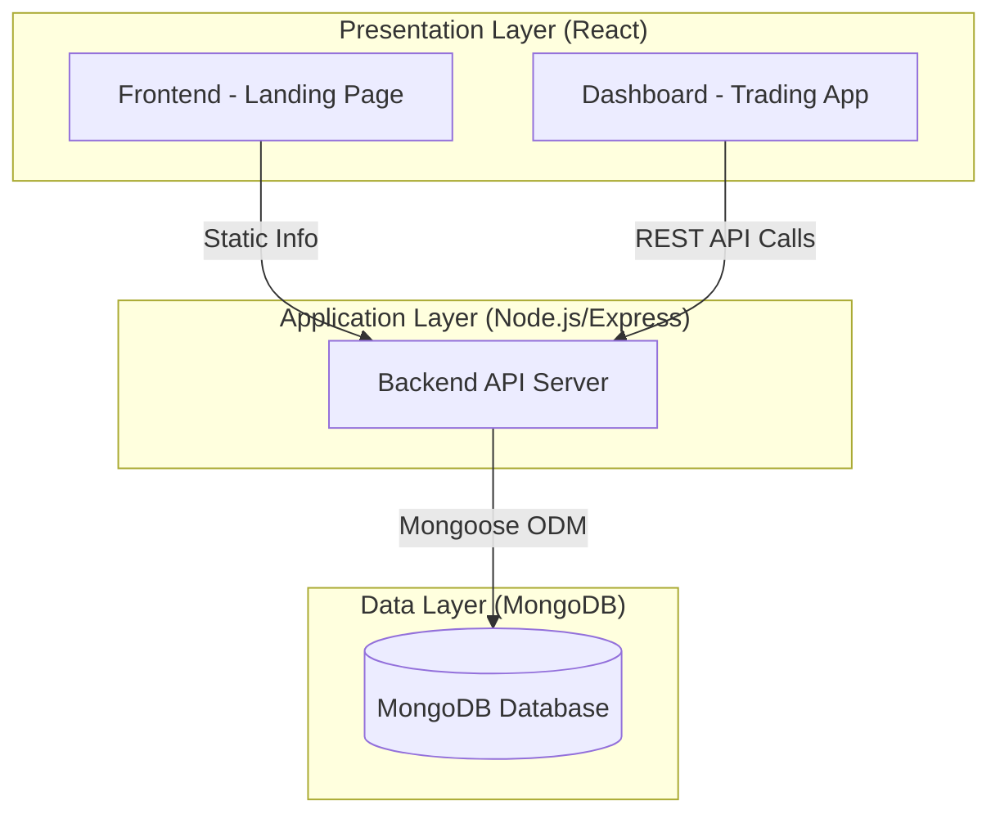
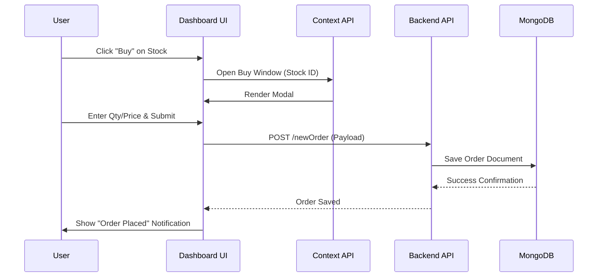

# Zerodha Clone - System Design Document

This document outlines the high-level architecture and system design of the Zerodha Clone project.

---

## 🏗️ High-Level Architecture

The system follows a **3-Tier Architecture** consisting of the Presentation Layer, Application Layer, and Data Layer. However, the Presentation Layer is split into two specialized applications for better separation of concerns.

---

## 📱 Component Breakdown

### 1. Presentation Layer
-   **Marketing Site (Frontend)**: Handles high-traffic landing pages. Optimized for SEO and user onboarding.
-   **Trading Dashboard (Dashboard)**: A heavy-duty SPA (Single Page Application). Manages complex states, real-time-like simulations, and data visualization.

### 2. Application Layer (Backend)
-   **Express.js Server**: Serves as the central hub. It exposes RESTful endpoints for the Dashboard.
-   **Business Logic**:
    -   Transaction recording (Buy/Sell).
    -   Portfolio aggregation (Calculating P&L).
    -   Authentication (Passport.js).

### 3. Data Layer (MongoDB)
-   **NoSQL Database**: Chosen for its flexibility with financial records and ease of horizontal scaling.
-   **Collections**: `holdings`, `positions`, `orders`, `users`.

---

## 🔐 Database Schema Design

The system uses three primary schemas to track user assets and activities:

### **Holdings Schema**
Tracks long-term investments.
- `name`: String (Stock Symbol)
- `qty`: Number
- `avg`: Number (Average Cost)
- `price`: Number (LTP - Last Traded Price)
- `net`: String (Percentage Change)

### **Positions Schema**
Tracks intra-day or active trading positions.
- `product`: String (CNC/MIS)
- `qty`: Number
- `price`: Number
- `isLoss`: Boolean (Visual indicator)

### **Orders Schema**
A historical log of all transactions.
- `name`: String
- `qty`: Number
- `price`: Number
- `mode`: String (BUY/SELL)

---

## 🔄 Sequence Diagram: Placing an Order

The following diagram illustrates the flow of data when a user places a buy order.

---

## 🛠️ Performance & Scalability

1.  **State Management**: Uses the **React Context API** to avoid "Prop Drilling". This ensures that the global state (like modal visibility) is managed efficiently across the Dashboard.
2.  **Data Visualization**: Uses **Chart.js** to handle complex rendering of financial data on the client-side, reducing server load.
3.  **Cross-Origin Support**: Implements `CORS` middleware in the backend to allow secure communication between different origins (Port 3000/3001 to Port 3002).

---

## 🚀 Future Enhancements
-   **WebSockets**: Implementing Socket.io for actual real-time stock price updates instead of static values.
-   **Redis Caching**: Caching frequently accessed stock data to reduce MongoDB query latency.
-   **Microservices**: Splitting the Order Management System (OMS) and Portfolio Management System (PMS) into separate services for higher availability.
