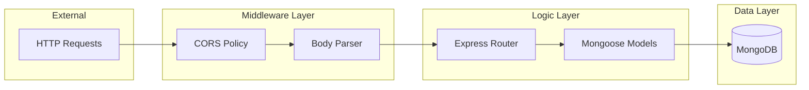

# Zerodha Clone - Backend System Design

This document details the internal architecture, API design, and data modeling of the Backend service.

---

## 🏗️ Backend Architecture

The backend follows a **Modular Monolith** pattern, where different concerns (Models, Schemas, Routes) are separated into specialized files and folders for better maintainability.

---

## 🛰️ API Design Specification

The API is designed following **RESTful principles**, using standard HTTP methods and status codes.

### **Endpoint Architecture**

| Endpoint | Method | Input (Body) | Responsibility |
| :--- | :--- | :--- | :--- |
| `/allHoldings` | `GET` | None | Fetches all documents from `holdings` collection. |
| `/allPositions` | `GET` | None | Fetches all documents from `positions` collection. |
| `/newOrder` | `POST` | `name, qty, price, mode` | Validates and saves a new transaction record. |
| `/addHoldings` | `GET` | None | Batch inserts mock data for development. |

---

## 🗄️ Database Modeling (Mongoose)

We use **Mongoose** as an ODM (Object Data Modeling) library to enforce a strict schema on top of MongoDB's flexible nature.

### **Model vs Schema Separation**
-   **Schemas** (`/schemas`): Define the "shape" of the data. This provides predictability and type safety (e.g., ensuring `qty` is always a Number).
-   **Models** (`/model`): Provide the interface for CRUD operations. For example, `HoldingsModel.find()` is used to query the database.

### **Schema Details**
-   **Orders**: Captures the state of a trade at a specific point in time. It is **immutable**; once an order is posted, it serves as a historical record.
-   **Holdings**: Represents aggregated state. In a production system, these would be updated based on successful order executions.

---

## 🔒 Security & Configuration

1.  **Environment Variables**: All sensitive data (database credentials, ports) is offloaded to a `.env` file via the `dotenv` package.
2.  **CORS Management**: The `cors` middleware is configured to allow requests only from trusted frontend origins (localhost:3000 and localhost:3001).
3.  **Authentication (Passport.js)**: 
    -   Uses `passport-local` for username/password strategy.
    -   `passport-local-mongoose` simplifies the integration of passport with MongoDB schemas.

---

## ⚡ Technical Decisions

1.  **Node.js/Express**: Chosen for high throughput and the ability to handle asynchronous requests efficiently (Non-blocking I/O).
2.  **Mongoose Validation**: Every `POST` request is validated by the Mongoose schema before hitting the database, preventing "dirty data" from being stored.
3.  **JSON Communication**: The system uses JSON for all request and response bodies, ensuring compatibility with any modern frontend framework.

---

## 📈 Scalability Strategy

-   **Statelessness**: The API is designed to be stateless. Any instance of the backend can handle any request, allowing the service to be horizontally scaled behind a Load Balancer.
-   **Connection Pooling**: Mongoose handles database connection pooling automatically, ensuring efficient reuse of connections to MongoDB.

---

## 🚧 Error Handling
Current implementation uses standard Express error handling. 
- **Future Improvement**: A centralized global error-handling middleware to catch all async errors and return standardized JSON responses like `{ success: false, error: "message" }`.
