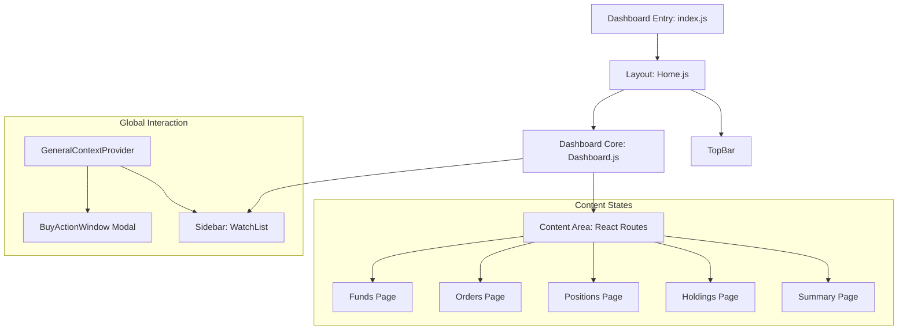

# Zerodha Clone - Dashboard System Design

The **Dashboard** is a sophisticated Single Page Application (SPA) designed to handle real-time-like interactions, complex data visualizations, and high-frequency UI updates.

---

## 🏗️ Dashboard Architecture

The dashboard uses a **Sidebar + Content** layout pattern. The sidebar remains persistent for quick stock tracking, while the content area changes based on the user's selected tab.

---

## 🔐 State Management Strategy

### 1. Global Context (`GeneralContext`)
Used specifically for managing cross-component interactions that affect the UI overlay:
- **`isBuyWindowOpen`**: Tracks whether the buy/sell modal should be visible.
- **`selectedStockUID`**: Stores the identifier of the stock currently being acted upon.
- **Why Context?**: This avoids passing callback functions through multiple levels of the component tree (Prop Drilling) from the `WatchList` items.

### 2. Local Component State
Used for specific UI logic within components:
- **`showWatchlistActions`**: Handles hover effects for individual stock items.
- **`allHoldings` / `allPositions`**: Stores data fetched from the API for the current session.

---

## 📊 Data Visualization (Charts)

The dashboard integrates **Chart.js** via `react-chartjs-2` to turn raw JSON data into actionable insights:
- **Doughnut Charts**: Integrated into the `WatchList` to show a quick breakdown of price distributions.
- **Vertical Bar Graphs**: Integrated into the `Holdings` section to provide a visual comparison between Investment Cost and Current Value.
- **Integration**: The system maps MongoDB document arrays directly to Chart.js `datasets` using JavaScript `.map()` functions.

---

## 🛰️ Backend Integration (Workflow)

The dashboard follows a **Pull-based Data Fetching** model:
1.  **Component Mounting**: When a user navigates to `/holdings`, the component triggers an asynchronous `Axios` call.
2.  **API Call**: `GET http://localhost:3002/allHoldings`.
3.  **JSON Parsing**: The response is parsed and passed into React state hooks (`useState`).
4.  **Reactive UI**: Any change in the state automatically updates the HTML tables and Chart.js instances.

---

## 🎨 UI & Design System

### **Material UI Componentry**
- **Tooltips**: Used in the Watchlist for action buttons (Buy, Sell, Graph).
- **Icons**: Standardized icons from `@mui/icons-material` for a consistent financial app look.
- **Micro-interactions**: Uses `Grow` and `Tooltip` components to provide smooth entrance animations for hover actions.

---

## 📈 Scalability & Performance

1.  **Code Splitting**: The use of React Router for the main content area (`/orders`, `/holdings`, etc.) allows for easy expansion without increasing the initial load time significantly.
2.  **Modular Logic**: The `BuyActionWindow` is decoupled from the `WatchList`, allowing it to be triggered from anywhere in the app (e.g., from a "Buy" button on the Holdings page in the future) merely by calling the Context function.

---

## 🚧 Future Improvements
-   **WebSocket Integration**: Replace standard HTTP polling with Socket.io for live market ticks.
-   **Redux/Zustand**: If state becomes more complex (e.g., managing a full user session, permissions, and complex cache), move from Context to a more robust state manager.
-   **Skeleton Loaders**: Add Material UI Skeletons to improve perceived performance during API data fetching.
