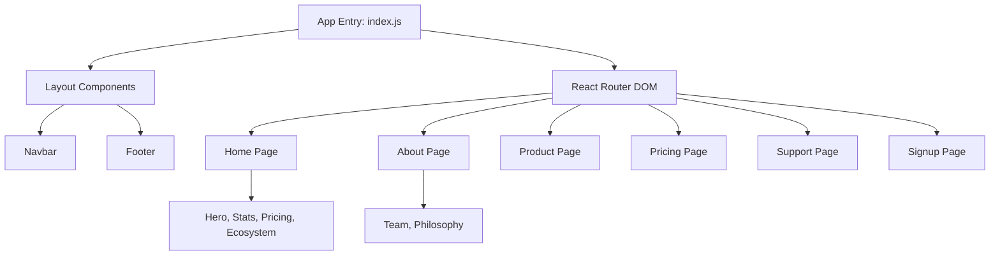

# Zerodha Clone - Frontend System Design

This document details the architectural decisions and design patterns used in the Frontend (Marketing Portal).

---

## 🏗️ Frontend Architecture

The frontend is designed as a **Component-Based React Application**, utilizing a hierarchical folder structure that maps directly to the user journey.

---

## 🧩 Design Patterns

### 1. Atomic Design Philosophy
While simplified, the project follows atomic-like principles:
-   **Atoms**: Basic components like Buttons, Links, and Inputs.
-   **Molecules**: Groups of atoms like a Search bar (Input + Icon).
-   **Organisms**: Complex sections like the `Hero` section or `Footer`.
-   **Pages**: Complete views formed by combining organisms.

### 2. Declarative Routing
Uses a centralized routing strategy in `index.js`. This makes it easy to add new marketing pages without modifying the layout logic. The `BrowserRouter` ensures smooth transitions without page reloads.

---

## 🎨 UI/UX System

### **Styling Strategy**
-   **Vanilla CSS**: Used for customized, brand-specific styling. The use of custom CSS ensures a pixel-perfect match with the original Zerodha design.
-   **Global Styles**: Handled in `index.css` for typography and basic reset rules.
-   **Scoping**: Component-specific styles are often kept within their respective folders to maintain high cohesion.

### **Typography & Palette**
-   **Fonts**: Utilizes system fonts (-apple-system, Segoe UI, Roboto) for maximum performance and native platform feel.
-   **Colors**: A curated palette of "Zerodha Blue" (#387ed1), neutral grays, and high-contrast whites to ensure readability and trust.

---

## 🔍 Search Engine Optimization (SEO)

As a marketing site, SEO is critical. The design incorporates:
1.  **Semantic HTML**: Proper use of `<h1>` through `<h6>`, `<section>`, `<nav>`, and `<footer>` tags.
2.  **Meta Metadata**: (Planned/Implementation ready) Page titles and descriptions are scoped per component to improve search indexing.
3.  **Fast Rendering**: Lightweight components ensure a high "Core Web Vitals" score.

---

## 🛰️ Integration & Communication

### **API Interaction**
-   **Axios**: Primarily used for capturing user interest (Newsletter signups, initial registration steps).
-   **Stateless Navigation**: Most communication is one-way (Read-only) as this part of the system doesn't require user authentication state.

---

## 📈 Scalability & Maintenance

1.  **Folder-per-Page Pattern**: Every page is its own directory (`/home`, `/about`). This makes it easy for multiple developers to work on different pages simultaneously without merge conflicts.
2.  **Shared Layouts**: The `Navbar` and `Footer` are lifted outside the `<Routes>` block to ensure they remain consistent and performant across the entire site.

---

## 🛠️ Future Improvements
-   **Styled Components / Emotion**: To achieve better CSS-in-JS scoping for extremely large component libraries.
-   **Server-Side Rendering (SSR)**: Moving to Next.js for even faster initial load times and better SEO crawling.
-   **PWA (Progressive Web App)**: Enabling offline access for help/support documentation.
